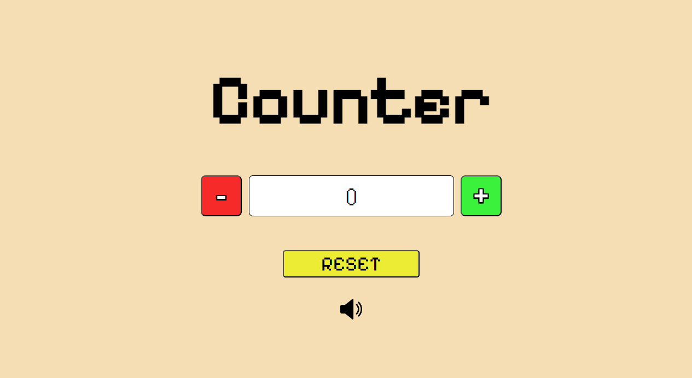

# Counter made with JavaScript



This is a simple counter which allows you to add or decrease the value by pressing the + and - keys.
A reset button has also been added to completely reset the counter.
Finally, sounds have also been added to the program when the mentioned keys are pressed, which can be deactivated by clicking on the audio image at the bottom of the page.


While the reset button was created using HTML, The keys and the counter were created dynamically using Javascript:

``````JavaScript
let minusButton = document.createElement("button");
minusButton.setAttribute("id", "minus");
minusButton.textContent = "-";
document.querySelector(".counterSection").appendChild(minusButton);

let counterNumber = document.createElement("div");
counterNumber.setAttribute("id", "counterNumber");
counterNumber.textContent = counter;
document.querySelector(".counterSection").appendChild(counterNumber);

let plusButton = document.createElement("button");
plusButton.setAttribute("id", "plus");
plusButton.textContent = "+";
document.querySelector(".counterSection").appendChild(plusButton);
``````

the sound was implemented using an ``<audio>`` element in the HTML:

``````HTML
<audio src="assets/audio/minusSound.mp3" id="minusAudio"></audio> 
``````

And enabled via JavaScript with a function:

``````Javascript
function minusPlay() {
    let audio = document.querySelector("#minusAudio");
    if (audio.paused) {
        audio.play();
    } else {
        audio.currentTime = 0;
    }
}
``````

Finally, the button to allow you to activate/deactivate the sounds was created like this:

``````Javascript
function changeSound(){
    if(volume){
        sound.src = "assets/images/volume.png"
    } else {
        sound.src = "assets/images/mute.png"
    }
}
``````

And changes image based on whether the audio is on or not.


## 🔗 Links

For my Github ----> https://github.com/Atlashish      
For my Work ------> https://counterjatlashish.netlify.app/


## Authors

- [@Atlashish](https://github.com/Atlashish/)


